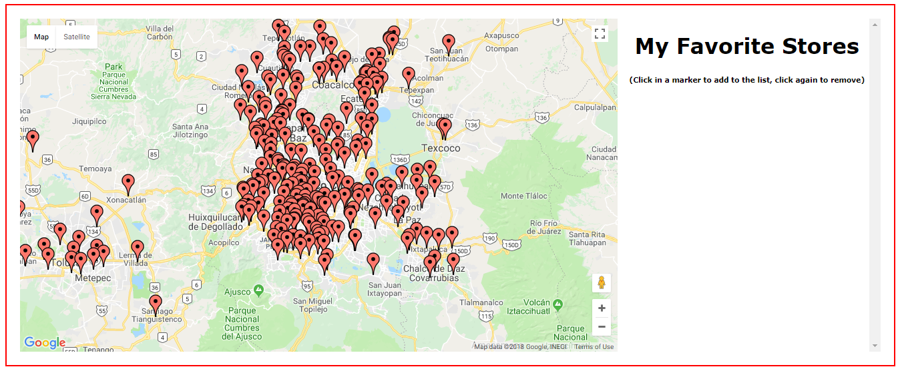
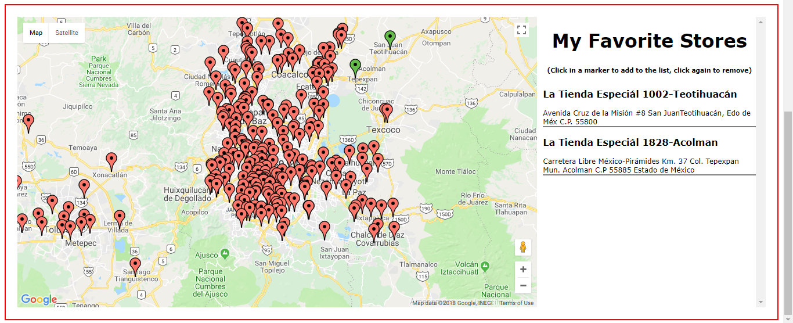
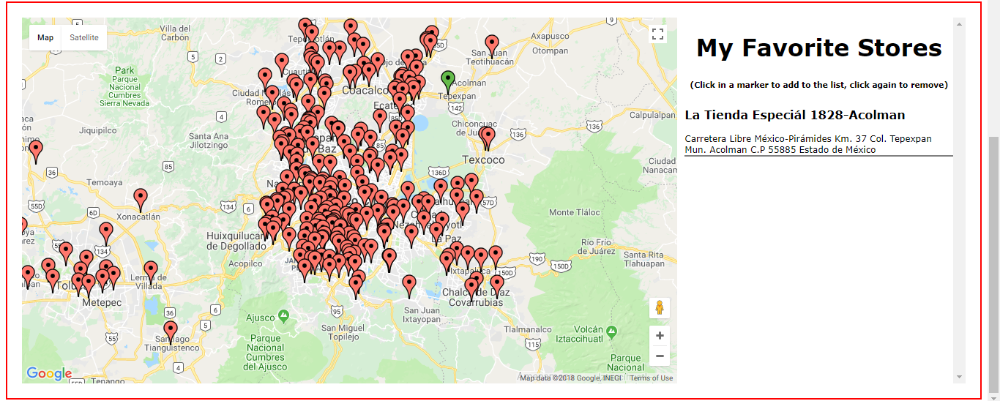

Generation Take-Home Coding Challenge
=================================

## How to run?
Clone the repo or decompress de zip file

Run

npm install
npm start
the exercise will open on http://localhost:3000

## What does the exercise do?
Once the page is loaded all the stores will show on the map on the left side. An empty list of favorites will be on the right.

To select a store as a favorite simply click the marker.

To remove the store from the favorites click the marker again.

The markers in the map will change to green if selected to the list.

## Libraries used:

google-maps-react for the use of the google maps API which displays the map and the markers
react-geocode for the use of geocode in order to find the coordinates of the stores to put them in the map
json-loader to extract the information from the JSON file

## Screenshots of the exercise

